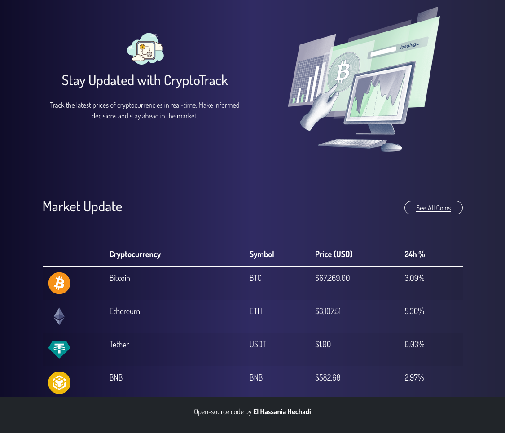
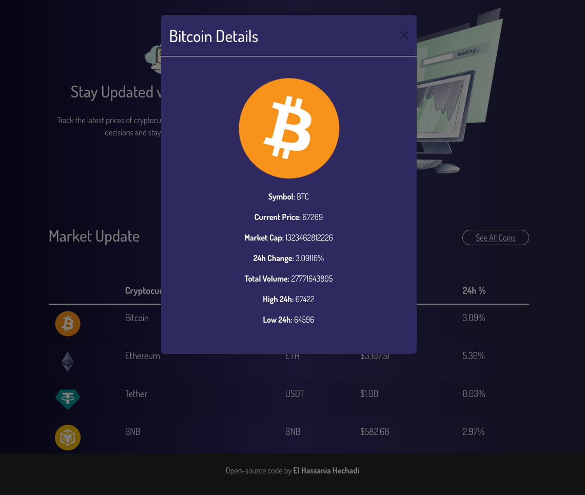

# CryptoTrack - Track Cryptocurrency Prices

CryptoTrack is a cryptocurrency tracking web application built using React, TypeScript, Vite, and Bootstrap. It allows users to view real-time cryptocurrency prices, along with detailed information about each cryptocurrency.

## Table of Contents

- [Demo](#demo)
- [Features](#features)
- [Prototype](#prototype)
  - [Header Section](#header-section)
  - [Hero Section](#hero-section)
  - [Market Update Section](#market-update-section)
  - [Footer Section](#footer-section)
- [Installation](#installation)
- [Usage](#usage)
- [Contributing](#contributing)
- [License](#license)

## Demo




## Features

- Real-time cryptocurrency price tracking.
- Detailed information about each cryptocurrency.
- Responsive design for seamless experience across devices.
- Automatic price updates every 5 seconds.
- Stylish and intuitive user interface.

#### Table of Cryptocurrencies
| Cryptocurrency | Symbol | Price (USD) |
|----------------|--------|-------------|
| Bitcoin        | BTC    | $60,000     |
| Ethereum       | ETH    | $2,500      |
| Litecoin       | LTC    | $300        |
...and more

## Prototype

### Header Section

The header section includes the title "CryptoTrack" and a brief description of the application.

### Hero Section

The hero section features an image and text explaining the purpose of the app.

### Market Update Section

The market update section displays a table showing the latest cryptocurrency prices.

### Footer Section

The footer section contains attribution to the developer.

## Installation

To install CryptoTrack, follow these steps:

1. Clone the repository:
    ```bash
    git clone https://github.com/hechadielhassania/CryptoTrack.git
    ```
2. Navigate to the project directory:
    ```bash
    cd crypto-track
    ```

3. Install dependencies:
    ```bash
    npm install
    ```

## Usage

To run CryptoTrack locally, use the following command:
    ```bash
    npm run dev
    ```

This will start the development server, and you can access the application at http://localhost:3000 in your web browser.


## Contributing

Contributions to CryptoTrack are welcome! If you have any ideas for new features, improvements, or bug fixes, feel free to open an issue or submit a pull request.

## Credits

- This project uses data from the [CoinGecko API](https://www.coingecko.com/api).
- Developed by El Hassania Hechadi.

## License

This project is licensed under the [MIT License](LICENSE).


